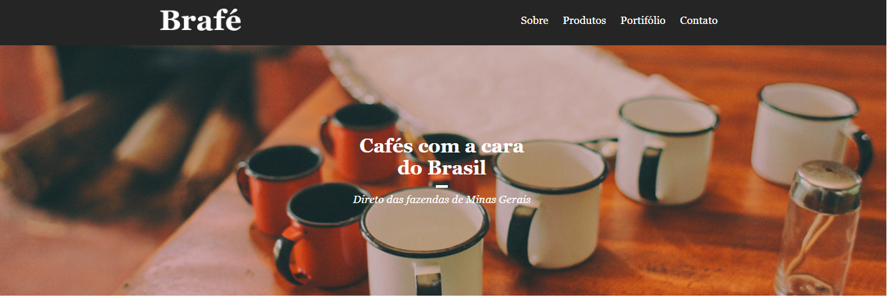
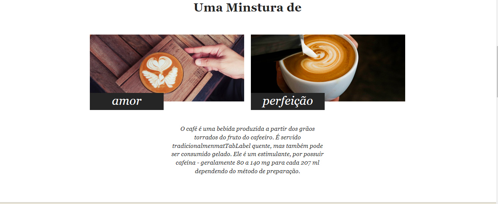
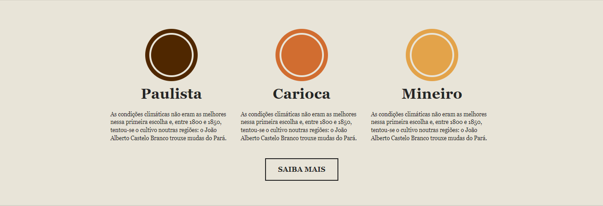
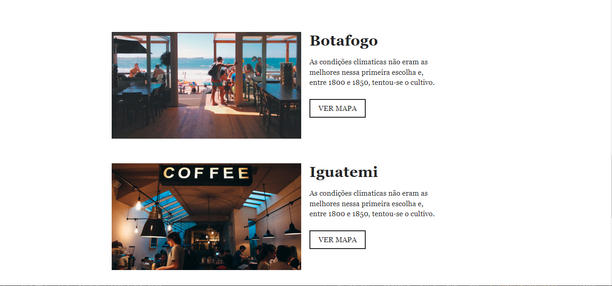
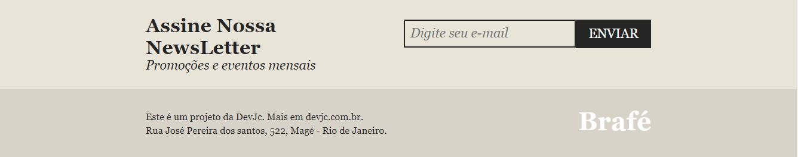
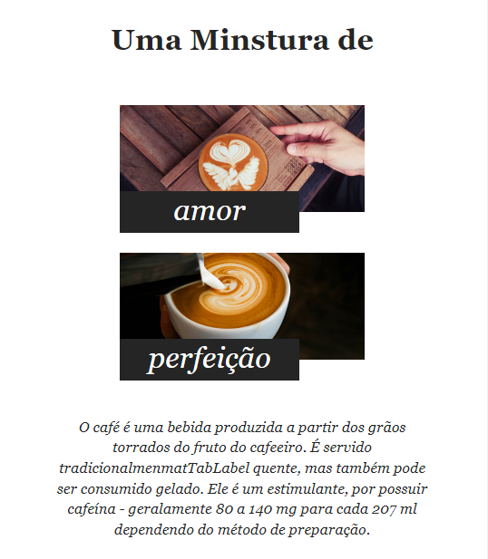
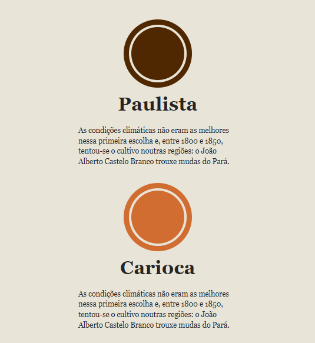
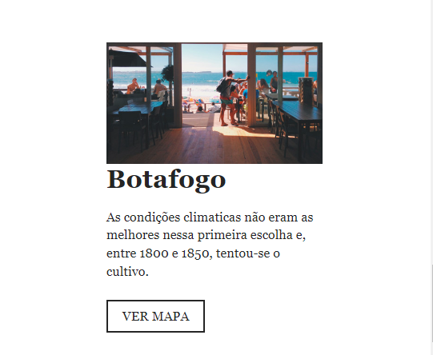

# Brafe


Café com a cara do Brasil ☕

## índice

- <a href="#layout">Layout</a>
- <a href="#Demonstracao">Demonstraçao</a>
- <a href="#rodar">Como rodar o projeto?</a>
- <a href="#tecnologias">Tecnologias Utilizadas</a>
- <a href="#autor">Autor</a>

## Layout












## Demonstraçao

[Link demonstração](https://emilio-jose-camilo.github.io/)

## Como rodar o projeto?

```bash
# Clone este repositório
$ git clone linkrepo
# Acessa a pasta do projeto no seu teminal
$ cd brafe
# Execute a aplicação com a extensão open with live server
$ clique no canto canto inferior da janela do vscode 
```

## 🛠Tecnologias Utilizadas
1. [html](https://developer.mozilla.org/pt-BR/docs/Web/HTML)
2. [css](https://developer.mozilla.org/pt-BR/docs/Web/CSS)

## Autor 


[linkedIn](https://www.linkedin.com/in/emilio-jos%C3%A9-794955208/)
